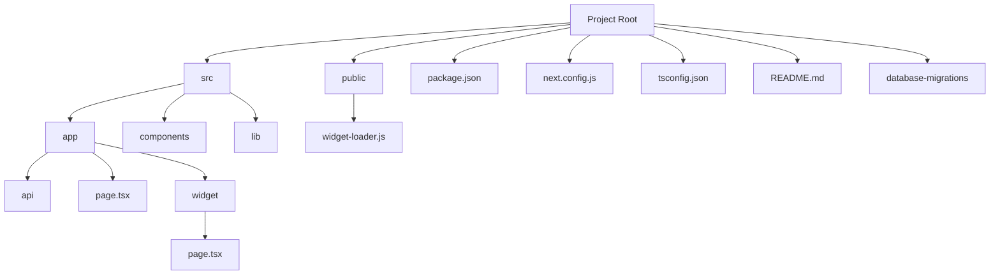

# Open-source AI chatbot for technical documentation websites

### TODO

1. Set up the following project structure

2. Set up database migrations. Custom function, support only up migrations, save status in a table in a schema. Read migrations from a folder. Example migration file name: `00001-create-data-source-table.sql`.

3. Test Together AI / Replica AI setup

Later
- set up auth.js
    - automate saving auth.js secret to vercel using: vercel env add AUTH_SECRET production < <(grep AUTH_SECRET .env.local | sed -n 's/.*="\([^"]*\)".*/\1/p' | tr -d '\n')
- Automate local dev setup: make auto-generated Together AI env var also available in dev environment (is prod and stag per default). E.g. make post-deploy script running vercel link & vercel env pull --environment=Production

