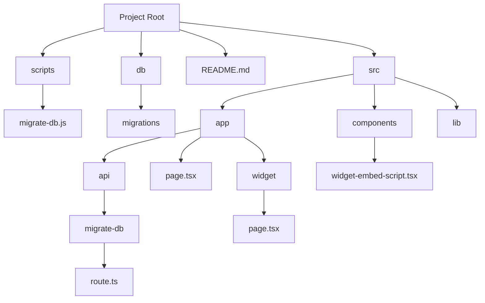

# Open-source AI chatbot for technical documentation websites

### TODO

- [x] Set up the following project structure

- [x] Set up database migrations. Custom function, support only up migrations, save status in a table in a schema. Read migrations from a folder. Example migration file name: `00001-create-data-source-table.sql`.

- [x] Test Together AI / Replica AI setup

**Indexing**
- [ ] Public Repo
- - [X] Analyze repo size and projected embedding costs
- - [ ] Index all
- - [ ] Index subset (include/exclude logic)
- [ ] Scrape Documentation Website
- - [X] Discover URLs to index
- - [X] Basic crawler settings (stay on domain, subdomain, path)
- - [ ] Add fragment/hash indexing/navigation for improved accuracy, especially on large pages (currently fragments are ignored)

**Querying**
- [ ] Boost certain files/folders

**Auth**
- [x] set up auth.js with github oauth
- [ ] add OpenDocuChat github org ID to repo
- [ ] use db table to verify which users have access
- [ ] automate saving auth.js secret to vercel using: vercel env add AUTH_SECRET production < <(grep AUTH_SECRET .env.local | sed -n 's/.*="\([^"]*\)".*/\1/p' | tr -d '\n')

**Other**
- [ ] Automate local dev setup: make auto-generated Together AI env var also available in dev environment (is prod and stag per default). E.g. make post-deploy script running vercel link & vercel env pull --environment=Production
