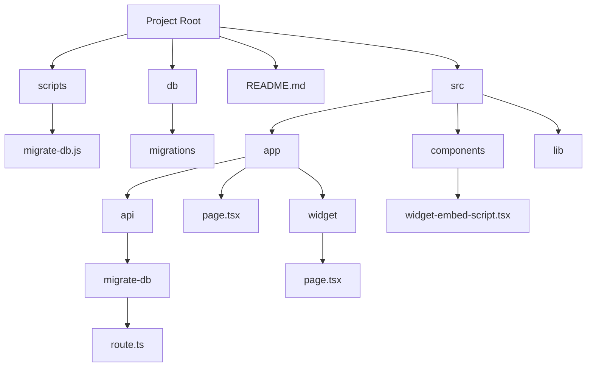

### TODO

- [x] Set up the following project structure

- [x] Set up database migrations. Custom function, support only up migrations, save status in a table in a schema. Read migrations from a folder. Example migration file name: `00001-create-data-source-table.sql`.

- [x] Test Together AI / Replica AI setup

**Indexing**
- [X] Scrape Documentation Website
- - [X] Discover URLs to index
- - [X] Basic crawler settings (stay on domain, subdomain, path)
- - [X] Viewer for scraped page contents
- - [X] Trigger scraper from frontend to keep running on vercel (&window closing warning)
- - [X] Improve cancellation & completion logic
- - [X] Add selected URLs to index, with cost estimate
- - [X] Add cleanup function for stuck scrapers
- - [ ] Add scraping progress indicator (# scraped vs queued, ETA, ...)
- - [ ] Make JS rendering optional setting
- - [ ] Save links and page hierarchy in content
- - [ ] Add background updates with cron jobs
- - [ ] Split longer documents into smaller ones using LLM
- - [ ] Fragment/hash indexing/navigation for improved accuracy, especially on large pages (currently fragments are ignored)
- [ ] Public Repo
- - [X] Analyze repo size and projected embedding costs
- - [ ] Index all
- - [ ] Index subset (include/exclude logic)

**Search (RAG)**
- [ ] Boost certain files/folders
- [ ] Use reranker

**Response**
- [X] Add chat widget
- [X] Update chat endpoints for basic llama & vercel pg 
- [ ] Use llama function calling (https://docs.together.ai/docs/llama-3-function-calling)
- [ ] Add warmup
- [ ] Search query generation from context ("explain more" -> "explain more about x")
- [ ] Add reranker
- [ ] Implement llama with citations
- [ ] Add full screen chat

**Auth & Security **
- [x] set up auth.js with github oauth
- [X] Enforce auth on (private) pages via middleware
- [X] Add vercel kv to deploy to vercel button
- [ ] use db table to verify which users have access
- [ ] Add custom URLs to CORS allowed origins
- [ ] add OpenDocuChat github org ID to repo
- [ ] automate saving auth.js secret to vercel using: vercel env add AUTH_SECRET production < <(grep AUTH_SECRET .env.local | sed -n 's/.*="\([^"]*\)".*/\1/p' | tr -d '\n')

**Other**
- [ ] Polish github readme
- [ ] Automate local dev setup: make auto-generated Together AI env var also available in dev environment (is prod and stag per default). E.g. make post-deploy script running vercel link & vercel env pull --environment=Production
